# {{AGENCY_NAME}} — Agent-Optimised Project Repo
## Implementation Specification
**Version 0.5 · 2026-03-23**
_Prepared for internal use by the project team_

---

## Table of Contents

1. [Overview](#1-overview)
2. [Workflow](#2-workflow)
3. [Folder Structure](#3-folder-structure)
4. [File Templates](#4-file-templates)
5. [SOP Changes](#5-sop-changes)
6. [Automation Scripts](#6-automation-scripts)
7. [Implementation Checklist](#7-implementation-checklist)

---

## 1. Overview

This document is the complete implementation specification for the agency's agent-optimised project repository structure. It covers the workflow design, folder structure, all MD file templates, agent skills, automation scripts, and sync rules.

The goal is to make the project GIT repo the single source of truth for every project — so that any team member, or any AI agent, can pick up any task at any point and immediately understand what is happening, what was decided, and why.

### 1.1 The Problem Being Solved

Context is generated at every stage of the workflow but captured nowhere consistently:

- Client emails and messages lose context when summarised into JIRA tickets
- Refinement decisions scatter across JIRA, Slack, Google Docs, and daily syncs
- Agents start execution sessions with no knowledge of upstream decisions
- Mode A (lightweight) work leaves no trace at all

### 1.2 The Team

| Person   | Role                        | Availability | Primary repo interaction                   |
|----------|-----------------------------|--------------|--------------------------------------------|
| [Name]   | CEO — reviews, decides      | —            | project.md, instructions.md, reviews       |
| [Name]   | Junior PM — coordinates, JIRA | Part time  | Digest PR review, sprint sync              |
| [Name]   | Developer — primary execution | Full time  | Agent sessions, end-session skill          |
| [Name]   | QA — tests DoD criteria     | Part time    | Session notes, quick-tasks log             |

### 1.3 Two Work Modes

**Mode A — Lightweight:** Request arrives (email, Slack, WhatsApp, verbal) → quick analysis → response or small fix → done. May skip JIRA entirely. Agent involvement is optional.

**Mode B — Full Scrum:** Request arrives → JIRA ticket → refinement → grooming → sprint planning → execution → DoD → deploy + close JIRA. Agent enters at execution.



---

## 2. Workflow

### 2.1 Scrum Cadence

| Event                   | Duration       | Frequency | Time          | Participants  |
|-------------------------|----------------|-----------|---------------|---------------|
| Ticket Refinement       | 15–30 min / async | Daily  | 08:00         | CEO + PM      |
| Daily Sync              | 15 min         | Daily     | 19:30         | All           |
| Grooming Session        | 30–60 min      | Weekly    | Friday 19:00  | All           |
| Sprint Planning + Retro | 15 min         | Weekly    | Sunday 19:00  | All           |

### 2.2 Context Capture Points

Three capture levels map to three folders in the repo:

- **Permanent** — decisions, architectural choices, client agreements → `docs/decisions/`
- **Sprint-lived** — active tasks, current sprint context → `tasks/`
- **Session-lived** — what the agent did, what was tried → `memory/`

> **Rule:** Anything that affects future decisions must be written to the repo. Anything that only affects today's execution can stay ephemeral.

### 2.3 Definition of Ready

- Properly described JIRA task with acceptance criteria
- Happy path and edge cases described
- Ticket estimated in story points (1, 2, 3, 5, 8)

### 2.4 Definition of Done

- All code changes pushed to version control
- Documentation updated if needed
- Solution tested by at least one other team member (QA)
- Tested on Chrome and Safari, desktop and mobile
- Verification status commented in JIRA with screenshot
- Deployed to production
- Client informed

---

## 3. Folder Structure

Each project has its own GIT repo with this structure. The website repo is added as a git submodule.

```
project-root/
├── .agent/                    ← Agent front door · always read first
│   ├── CONTEXT.md             AUTO-GENERATED on every merge
│   ├── project.md             Human-written once at kickoff
│   ├── instructions.md        Standing rules, constraints, never-dos
│   └── skills/
│       ├── start-session.md   Skill: pull + load context
│       ├── log-mode-a.md      Skill: log lightweight work
│       └── end-session.md     Skill: commit + write session summary
│
├── docs/                      Permanent knowledge · outlives any sprint
│   ├── decisions/             Architectural + client decisions (ADRs)
│   ├── specs/                 Exported from Google Drive as markdown
│   │   └── sow-shared.md      Shared SoW (scope, deliverables — no financials)
│   └── client-comms/          Key email summaries from daily digest
│
├── tasks/                     Sprint-lived · active work items
│   ├── current-sprint.md      AUTO-SYNCED from JIRA every Sunday 20:00
│   └── backlog.md             Groomed backlog overview
│
├── memory/                    Session-lived · ephemeral context
│   ├── quick-tasks.md         Mode A log · append-only
│   └── sessions/
│       └── YYYY-MM-DD.md      End-session summaries
│
├── digest/                    n8n PR landing zone · reviewed by the PM
│   └── YYYY-MM-DD.csv         Classified Slack + Gmail · routed on merge
│
├── scripts/                   Automation scripts
│   ├── generate-context.py    Rebuilds .agent/CONTEXT.md
│   └── route-digest.py        Routes digest CSV to correct folders
│
├── .github/
│   └── workflows/
│       ├── context-update.yml Regenerate CONTEXT.md on every merge
│       └── digest-router.yml  Route digest files + trigger context update
│
├── .cursorrules               Tells Cursor: read CONTEXT.md before any task
├── website/                   Git submodule → website repo
└── README.md                  How this repo works · team onboarding
```



### 3.1 What Is Human vs Automated

| File / folder                    | Owner              | When                            |
|----------------------------------|--------------------|---------------------------------|
| `.agent/CONTEXT.md`              | GitHub Actions     | Every merge — fully automatic   |
| `tasks/current-sprint.md`        | n8n + GH Actions   | Every Sunday 20:00 — automatic  |
| `digest/YYYY-MM-DD.csv`          | n8n + Claude       | Every night 03:00 — automatic   |
| `docs/decisions/` routing        | GitHub Actions     | On digest PR merge — automatic  |
| `.agent/project.md`              | CEO or PM          | Once at project kickoff         |
| `.agent/instructions.md`         | CEO or PM          | Once at kickoff, updated rarely |
| `docs/specs/sow-shared.md`       | CEO or PM          | At kickoff + scope changes      |
| `.cursorrules`                   | CEO or PM          | Once at kickoff                 |
| `memory/sessions/YYYY-MM-DD.md`  | Agent (end-session skill) | End of every session     |
| `memory/quick-tasks.md`          | Agent (log-mode-a skill)  | After every Mode A task  |

---

## 4. File Templates

### 4.1 `.agent/CONTEXT.md` (auto-generated)



> This file is always written by GitHub Actions. Never edit it manually.

```markdown
<!-- AUTO-GENERATED by GitHub Actions on every merge. Do not edit. -->
<!-- Last updated: {{TIMESTAMP}} -->

# {{PROJECT_NAME}} · context snapshot

## Status
- Sprint: {{SPRINT_NAME}} · ends {{SPRINT_END_DATE}}
- Last merge: {{LAST_MERGE_TIMESTAMP}} · {{LAST_MERGE_AUTHOR}}
- Open Mode A items: {{MODE_A_OPEN_COUNT}} (see memory/quick-tasks.md)

## Active sprint
- [ ] PROJ-123 · Task title · [Developer] · 3pts
- [ ] PROJ-124 · Task title · [Developer] · 2pts

## Last 3 decisions
- YYYY-MM-DD · Decision title · docs/decisions/YYYY-MM-DD-slug.md

## Open Mode A items
- YYYY-MM-DD · Source · What was asked · Status

## For the agent
- Read .agent/project.md for client, stack, contacts
- Read .agent/instructions.md for standing rules
- Skills: .agent/skills/
- JIRA project: {{JIRA_PROJECT_KEY}}
```

---

### 4.2 `.agent/project.md` (human · once)

```markdown
# {{PROJECT_NAME}} · project context

## Client
- Name: {{CLIENT_NAME}}
- Primary contact: {{CONTACT_NAME}} · {{CONTACT_EMAIL}}
- Language: {{LANGUAGE}}
- Timezone: {{TIMEZONE}}

## What we are building
{{PROJECT_DESCRIPTION}}

## Tech stack
- Platform: {{PLATFORM}}   # Framer / WordPress / Next.js
- Repo (website): {{WEBSITE_REPO_URL}}
- Repo (project): {{PROJECT_REPO_URL}}
- Hosting: {{HOSTING}}
- CMS: {{CMS}}

## Tools
- JIRA: {{JIRA_PROJECT_KEY}} · {{JIRA_URL}}
- Google Drive: {{GDRIVE_FOLDER_URL}}
- Slack channel: {{SLACK_CHANNEL}}
- Clockify project: {{CLOCKIFY_PROJECT_NAME}}

## Team
| Person   | Role      | Availability |
|----------|-----------|--------------|
| [Name]   | CEO       | —            |
| [Name]   | Junior PM | Part time    |
| [Name]   | Developer | Full time    |
| [Name]   | QA        | Part time    |

## Contract & scope
- Type: {{CONTRACT_TYPE}}
- SoW (shared): docs/specs/sow-shared.md
- SoW (private): {{SOW_GDRIVE_LINK}} · restricted
- Retainer period: {{RETAINER_PERIOD}}

## Key dates
- Project start: {{START_DATE}}
- Next milestone: {{NEXT_MILESTONE}} · {{MILESTONE_DATE}}
- Go-live / deadline: {{DEADLINE}}

## Notes for the agent
{{PROJECT_NOTES}}
```

---

### 4.3 `.agent/skills/start-session.md`

```markdown
# Skill: start-session

## Trigger phrases
start session, start-session, let's start, begin session

## Steps

### 1. Pull latest repo (local only)
Run: git pull --rebase
If conflicts: stop and surface to user before continuing.

### 2. Show what changed since last session
Run: git log --oneline HEAD@{1}..HEAD
Summarise changes grouped by folder in plain language.

### 3. Read and surface CONTEXT.md
Read .agent/CONTEXT.md in full. Present as a structured briefing:
current sprint + end date, open tasks, last 3 decisions, open Mode A items.

### 4. Read instructions.md silently
Apply all standing rules for the duration of this session.

### 5. Confirm readiness
End with:
"Ready. [PROJECT_NAME] · Sprint [X] · [N] tasks in scope.
Last session: [DATE] by [AUTHOR]. What are we working on?"

## Notes
- For Claude.ai web users: skip steps 1–2. Paste CONTEXT.md as first message.
- Never begin task work before completing this skill.
- If CONTEXT.md is missing: alert the user — repo may not be set up correctly.
```

---

### 4.4 `.agent/skills/log-mode-a.md`

```markdown
# Skill: log-mode-a

## Trigger phrases
log this, log mode a, log quick task, this was a quick fix log it

## Steps

### 1. Gather four fields
Infer from conversation or ask:
- Source: Email / Slack / WhatsApp / Verbal
- Request: one sentence — what was asked
- Resolution: one sentence — what was done
- Status: open / resolved / needs-follow-up

Confirm before writing:
"Logging: [Source] · [request] · [resolution] · [status]. Correct?"

### 2. Append to memory/quick-tasks.md
Format: | YYYY-MM-DD | Source | Request | Resolution | Status |
Never overwrite. Always append.
Create file with header row if it does not exist.

### 3. Check promotion to JIRA
Suggest creating a JIRA ticket if any of:
- Resolution took or will take > 2 hours
- Same request appeared more than once in quick-tasks.md
- Involves a decision affecting other parts of the project
- Client referenced it as part of scope

### 4. Confirm
"Logged to memory/quick-tasks.md. Status: [STATUS]."
```

---

### 4.5 `.agent/skills/end-session.md`

```markdown
# Skill: end-session

## Trigger phrases
end session, end-session, we're done for today, wrap up, closing session

## Steps

### 1. Write session note to memory/sessions/YYYY-MM-DD.md
If file exists: append with --- [HH:MM] --- separator.

Structure:
---
## Session · YYYY-MM-DD
**Who:** [person]
**Duration:** [approximate]
**Sprint tasks worked on:**
- PROJ-123 · [what was done] · [status]
**Decisions made:**
- [decision] or None
**What the agent tried that didn't work:**
- [failed approaches] or None
**Open threads:**
- [unresolved items] or None
**Next session should start with:**
- [specific instruction]
---

### 2. Check Mode A items
Scan memory/quick-tasks.md for needs-follow-up items.
Surface them if found.

### 3. Commit changes (local only)
Stage: .agent/, docs/, tasks/, memory/
Suggest message: "session: YYYY-MM-DD · [one line summary] [skip ci]"
Wait for user confirmation before committing.
Never force push or commit to main directly.

### 4. Confirm
"Session closed. Summary at memory/sessions/YYYY-MM-DD.md."
```

---

## 5. SOP Changes

### 5.1 Statement of Work — Two Versions

> **New process requirement.** Both versions must be created and maintained for every project.

Every project must maintain two versions of the Statement of Work:

**Shared SoW** — stored at `docs/specs/sow-shared.md` in the project repo. Contains: project scope, deliverables, milestones, acceptance criteria, tech stack decisions. Safe for the full team and agent context.

**Private SoW** — stored in Google Drive under the project's Management folder (restricted access). Contains everything in the shared version plus: budget, contracted hours, hourly rates, payment terms, client invoicing details.

When scope changes, both versions must be updated. The agent always reads the shared version. The private link is stored in `project.md` for the CEO and PM.

---

## 6. Automation Scripts

### 6.1 Sync Rules Overview

| Rule | Trigger             | Tool       | Action                                    | Repo target              |
|------|---------------------|------------|-------------------------------------------|--------------------------|
| 1    | Every merge to main | GH Actions | Regenerate CONTEXT.md                     | `.agent/CONTEXT.md`      |
| 2    | digest/* merge      | GH Actions | Route CSV to folders                      | `docs/` `memory/`        |
| 3    | 3 AM daily          | n8n        | Read Slack+Gmail, Claude classifies, PR   | `digest/YYYY-MM-DD.csv`  |
| 4    | Sunday 20:00        | n8n        | Pull JIRA sprint, format MD, commit       | `tasks/current-sprint.md`|
| 5    | Slack /session      | n8n        | Receive session note, commit to repo      | `memory/sessions/`       |

> Rule 1 is always the last step of every other rule. Every automation ends by regenerating CONTEXT.md so the next session always reads current state.



---

### 6.2 `.github/workflows/context-update.yml`

```yaml
name: Update CONTEXT.md

on:
  push:
    branches: [main]
  workflow_call:

jobs:
  update-context:
    runs-on: ubuntu-latest
    permissions:
      contents: write

    steps:
      - uses: actions/checkout@v4
        with: { fetch-depth: 0 }

      - uses: actions/setup-python@v5
        with: { python-version: '3.11' }

      - name: Generate CONTEXT.md
        run: python scripts/generate-context.py
        env:
          JIRA_PROJECT_KEY: ${{ vars.JIRA_PROJECT_KEY }}
          PROJECT_NAME: ${{ vars.PROJECT_NAME }}

      - name: Commit if changed
        run: |
          git config user.name "agency-bot"
          git config user.email "bot@example.com"
          git diff --quiet .agent/CONTEXT.md || (
            git add .agent/CONTEXT.md &&
            git commit -m "chore: regenerate CONTEXT.md [skip ci]" &&
            git push
          )
```

---

### 6.3 `.github/workflows/digest-router.yml`

```yaml
name: Route Digest

on:
  push:
    branches: [main]
    paths: ['digest/**.csv']

jobs:
  route-digest:
    runs-on: ubuntu-latest
    permissions: { contents: write }

    steps:
      - uses: actions/checkout@v4

      - uses: actions/setup-python@v5
        with: { python-version: '3.11' }

      - name: Detect merged digest file
        id: detect
        run: |
          FILE=$(git diff-tree --no-commit-id -r --name-only HEAD \
                 | grep '^digest/' | head -1)
          echo "digest_file=$FILE" >> $GITHUB_OUTPUT

      - name: Route digest content
        if: steps.detect.outputs.digest_file != ''
        run: python scripts/route-digest.py "${{ steps.detect.outputs.digest_file }}"

      - name: Commit routed files
        run: |
          git config user.name "agency-bot"
          git config user.email "bot@example.com"
          git add docs/ memory/
          git diff --cached --quiet || (
            git commit -m "chore: route digest [skip ci]" && git push
          )

  refresh-context:
    needs: route-digest
    uses: ./.github/workflows/context-update.yml
```

---

### 6.4 `scripts/generate-context.py`

```python
#!/usr/bin/env python3
"""Regenerates .agent/CONTEXT.md from current repo state."""
import os, re, subprocess
from datetime import datetime
from pathlib import Path

ROOT         = Path(__file__).parent.parent
PROJECT_NAME = os.environ.get('PROJECT_NAME', 'Project')
JIRA_KEY     = os.environ.get('JIRA_PROJECT_KEY', 'PROJ')

def git_last_merge():
    r = subprocess.run(['git','log','-1','--pretty=format:%an · %ar'],
                       capture_output=True, text=True)
    return r.stdout.strip() or 'unknown'

def read_sprint():
    f = ROOT / 'tasks' / 'current-sprint.md'
    if not f.exists(): return 'No sprint', 'unknown', []
    c = f.read_text()
    m = re.search(r'# Sprint (.+?) · ends (\S+)', c)
    name = m.group(1) if m else 'Current sprint'
    end  = m.group(2) if m else 'unknown'
    return name, end, re.findall(r'- \[.\] .+', c)[:10]

def read_last_decisions(n=3):
    d = ROOT / 'docs' / 'decisions'
    if not d.exists(): return []
    files = sorted(d.glob('*.md'), reverse=True)[:n]
    out = []
    for f in files:
        date  = f.stem[:10]
        lines = f.read_text().splitlines()
        title = next((l.lstrip('# ') for l in lines if l.startswith('#')), f.stem)
        out.append(f'- {date} · {title} · docs/decisions/{f.name}')
    return out

def read_open_mode_a():
    qt = ROOT / 'memory' / 'quick-tasks.md'
    if not qt.exists(): return []
    items = []
    for line in qt.read_text().splitlines():
        if '|' in line and ('open' in line.lower() or 'needs-follow-up' in line.lower()):
            cols = [c.strip() for c in line.split('|') if c.strip()]
            if len(cols) >= 3:
                items.append(f'- {cols[0]} · {cols[1]} · {cols[2]}')
    return items[:5]

if __name__ == '__main__':
    now      = datetime.utcnow().strftime('%Y-%m-%d %H:%M UTC')
    sprint_name, sprint_end, tasks = read_sprint()
    decisions = read_last_decisions()
    mode_a    = read_open_mode_a()

    ctx = f"""<!-- AUTO-GENERATED. Do not edit manually. -->
<!-- Last updated: {now} -->

# {PROJECT_NAME} · context snapshot

## Status
- Sprint: {sprint_name} · ends {sprint_end}
- Last merge: {git_last_merge()}
- Open Mode A items: {len(mode_a)} (see memory/quick-tasks.md)

## Active sprint
{chr(10).join(tasks) or '- No tasks found'}

## Last 3 decisions
{chr(10).join(decisions) or '- No decisions recorded yet'}

## Open Mode A items
{chr(10).join(mode_a) or '- None'}

## For the agent
- Read .agent/project.md for client, stack, contacts
- Read .agent/instructions.md for standing rules
- Skills: .agent/skills/
- JIRA project: {JIRA_KEY}
"""
    out = ROOT / '.agent' / 'CONTEXT.md'
    out.parent.mkdir(parents=True, exist_ok=True)
    out.write_text(ctx)
    print(f'CONTEXT.md written ({out.stat().st_size} bytes)')
```

---

### 6.5 `scripts/route-digest.py`

```python
#!/usr/bin/env python3
"""
Parses digest/YYYY-MM-DD.csv and routes each row to the correct folder.

Format (semicolon-delimited, no quoting required):
  type;project;title;content
  decision;PROJ;Hero layout change;Client confirmed final layout.
  question;PROJ;Project status;Client asked about current status?
  mode-a;CTC;Fix logo swap;Swap requested; updated and published.

Parsing: split on first 3 semicolons only (maxsplit=3).
Semicolons inside content are safe — never treated as delimiters.
Required: type, project, title. Content is optional.

# FORMAT CONTRACT: see also n8n daily-digest workflow Node 6 prompt.
# If you change column order or delimiter, update the Claude prompt too.
"""
import sys, re
from pathlib import Path

ROOT         = Path(__file__).parent.parent
VALID_TYPES  = {'decision', 'client-comms', 'mode-a', 'question'}
REQUIRED     = {'type', 'project', 'title'}

def parse_csv(text):
    rows = []
    for i, line in enumerate(text.strip().splitlines()[1:], start=2):
        line = line.strip()
        if not line: continue
        parts = line.split(';', 3)
        rows.append({
            'type':    parts[0].strip() if len(parts) > 0 else '',
            'project': parts[1].strip() if len(parts) > 1 else '',
            'title':   parts[2].strip() if len(parts) > 2 else '',
            'content': parts[3].strip() if len(parts) > 3 else '',
            '_line':   i,
        })
    return rows

def validate(row):
    missing = [f for f in REQUIRED if not row.get(f,'').strip()]
    if missing:
        raise ValueError(f"Line {row['_line']}: missing {', '.join(missing)}")
    if row['type'].lower() not in VALID_TYPES:
        raise ValueError(f"Line {row['_line']}: unknown type '{row['type']}'")

def slug(t): return re.sub(r'[^a-z0-9]+','-',t.lower()).strip('-')[:50]

def route_decision(row, date):
    d = ROOT/'docs'/'decisions'; d.mkdir(parents=True, exist_ok=True)
    (d/f"{date}-{row['project'].lower()}-{slug(row['title'])}.md").write_text(
        f"# {row['title']}\n\n**Date:** {date}  \n"
        f"**Project:** {row['project']}  \n**Source:** Daily digest\n\n"
        f"{row.get('content','')}\n")

def route_client_comms(row, date):
    d = ROOT/'docs'/'client-comms'; d.mkdir(parents=True, exist_ok=True)
    (d/f"{date}-{row['project'].lower()}-{slug(row['title'])}.md").write_text(
        f"# {row['title']}\n\n**Date:** {date}  \n"
        f"**Project:** {row['project']}\n\n{row.get('content','')}\n")

def route_question(row, date):
    row = dict(row); row['title'] = f"[question] {row['title']}"
    route_client_comms(row, date)

def route_mode_a(row, date):
    qt = ROOT/'memory'/'quick-tasks.md'
    qt.parent.mkdir(parents=True, exist_ok=True)
    if not qt.exists():
        qt.write_text('# Quick tasks log\n\n'
            '| Date | Project | Title | Content | Status |\n'
            '|------|---------|-------|---------|--------|\n')
    content = row.get('content','').replace('|','/')
    with qt.open('a') as f:
        f.write(f"| {date} | {row['project']} | {row['title']} | {content} | open |\n")

ROUTERS = {'decision': route_decision, 'client-comms': route_client_comms,
           'question': route_question, 'mode-a': route_mode_a}

if __name__ == '__main__':
    if len(sys.argv) < 2: print('Usage: route-digest.py digest/YYYY-MM-DD.csv'); sys.exit(1)
    path = ROOT / sys.argv[1]
    if not path.exists(): print(f'ERROR: {path} not found'); sys.exit(1)
    rows = parse_csv(path.read_text())
    print(f'Routing {len(rows)} rows from {path.name}')
    errors, routed, skipped = [], 0, 0
    for row in rows:
        try:
            validate(row)
            ROUTERS[row['type'].lower()](row, path.stem)
            print(f"  → {row['type']} · {row['title']}")
            routed += 1
        except ValueError as e:
            print(f'  ✗ {e}'); errors.append(str(e)); skipped += 1
    print(f'\nDone: {routed} routed, {skipped} skipped.')
    if errors: [print(f'  - {e}') for e in errors]; sys.exit(1)
```



---

### 6.6 n8n Workflow: daily-digest (3 AM)



Configure in n8n as a new workflow with the following nodes in order:

1. **Schedule Trigger** — Cron: `0 3 * * *` (3 AM every day)
2. **Slack · Get Messages** — `conversations.history`, project channels, last 24h, exclude bots
3. **Gmail · Search Messages** — `newer_than:1d label:client`, max 50 results
4. **Merge** — append both sources, add `source` field per item
5. **If · Any messages?** — false branch goes to Node 9
6. **HTTP Request · Claude API** — POST to `https://api.anthropic.com/v1/messages`
7. **If · Output empty?** — check if CSV has only header row, true branch to Node 9
8. **GitHub · Create File + Pull Request** — branch: `digest/YYYY-MM-DD`
9. **Slack · Notify PM** — `#internal` with PR link or "nothing to log"

**Claude system prompt for Node 6:**

```
You are a project management assistant for {{AGENCY_NAME}} ({{AGENCY_SHORT}}).
Classify Slack and email messages from the past 24 hours into a
semicolon-delimited CSV digest.

OUTPUT RULES:
- Output ONLY the CSV. No preamble, no explanation, no markdown.
- First line must be the header row exactly as shown.
- Use semicolon (;) as delimiter.
- Content is always the last field — never add fields after it.
- If nothing qualifies, output only the header row.

HEADER (copy exactly):
type;project;title;content

VALID TYPES:
  decision     → affects future work or architecture
  client-comms → client feedback, requests, statements
  question     → client question needing a response
  mode-a       → quick task done or to be done outside JIRA

REQUIRED: type, project, title. Content is optional.
VALID PROJECT KEYS: {{JIRA_PROJECT_KEY}}

SKIP: greetings, reactions, 'OK'/'Thanks' with no substance, duplicates.
```

---

### 6.7 n8n Workflow: sprint-sync (Sunday 20:00)

1. **Schedule Trigger** — Cron: `0 20 * * 0` (20:00 every Sunday)
2. **HTTP Request** — GET JIRA active sprint for board
3. **HTTP Request** — GET sprint issues (summary, assignee, story_points, status)
4. **Code** — Format issues as markdown table with sprint name and end date header
5. **GitHub · Update File** — commit to `tasks/current-sprint.md` on main `[skip ci]`
6. **HTTP Request** — Trigger `context-update.yml` via GitHub Actions dispatch API

**The `tasks/current-sprint.md` header format** (required by `generate-context.py`):

```markdown
# Sprint {{sprintName}} · ends {{sprintEndDate}}

| Ticket  | Summary           | Assignee | Points | Status      |
|---------|-------------------|----------|--------|-------------|
| PROJ-45 | Fix hero padding  | [Name]   | 2      | In Progress |
```

---

### 6.8 n8n Workflow: session-webhook (Slack /session)

1. **Webhook** — POST `/session-note`, verify Slack signing secret
2. **Code** — Parse Slack payload, map channel name to project repo
3. **If · Valid project mapping?** — false: reply "Unknown channel, use #proj-\*"
4. **Code** — Format session note with date and username header
5. **GitHub · Create or Update File** — `memory/sessions/YYYY-MM-DD.md`
6. **HTTP Request** — Trigger `context-update.yml` on project repo
7. **Slack · Reply** — confirm commit path to user

> The `/session` Slack slash command must be registered in Slack app settings pointing to the n8n webhook URL. Channel names must start with `#proj-` for project mapping to work. If n8n is self-hosted behind a firewall, expose via Cloudflare Tunnel.

---

## 7. Implementation Checklist

### Phase 1 — Repo Setup (CEO or PM, once)

1. Create project GIT repo on GitHub
2. Add website repo as git submodule: `git submodule add [url] website/`
3. Create folder structure: `.agent/` `docs/` `tasks/` `memory/` `digest/` `scripts/` `.github/workflows/`
4. Copy all scripts from this spec into `scripts/` and `.github/workflows/`
5. Set GitHub repo variables: `PROJECT_NAME`, `JIRA_PROJECT_KEY`
6. Fill in `.agent/project.md` with client and project details
7. Write `.agent/instructions.md` with project-specific standing rules
8. Add `.cursorrules` with instruction to read `.agent/CONTEXT.md` before any task
9. Create `docs/specs/sow-shared.md` from the shared SoW
10. Run `generate-context.py` manually to create initial `CONTEXT.md`
11. Commit and push — verify `context-update.yml` runs cleanly

### Phase 2 — n8n Setup (PM)

1. Import daily-digest workflow, configure Slack + Gmail credentials
2. Set project channel IDs and JIRA board ID as workflow variables
3. Import sprint-sync workflow, configure JIRA API credentials
4. Create `/session` Slack slash command pointing to session-webhook n8n URL
5. Run daily-digest manually once to verify Claude output and PR creation
6. Run sprint-sync manually once to verify `tasks/current-sprint.md` format

### Phase 3 — Team Onboarding

1. Share this document with the developer and QA
2. Developer: clone project repo, verify `.cursorrules` loads in Cursor
3. Developer: run `start session` skill, verify CONTEXT.md is read correctly
4. Team: agree on trigger phrases for start-session, log-mode-a, end-session
5. PM: review first digest PR, confirm routing is correct

---

## 8. Future Considerations

These items were identified during the design phase but deferred. They require no structural changes — the repo is designed to absorb them when ready.

| Topic | Status | Notes |
|-------|--------|-------|
| WhatsApp integration | Deferred | Add as a third n8n input stem alongside Slack and Gmail — no downstream changes needed |
| Vector DB / Supabase memory | Deferred | Relevant only when `memory/` grows too large for agents to read as flat files. Flat files first, migrate later |
| JIRA ticket creation skill | Phase 2 | Agent skill to create JIRA tickets from conversation context |
| Client email drafting skill | Phase 2 | Agent skill to draft client-facing emails for review |
| DoD checklist skill | Phase 2 | Agent skill to verify Definition of Done criteria before closing a ticket |
| Obsidian / structured memory | Not yet explored | Could complement the flat file approach for long-term knowledge |
| Google Drive → markdown sync | Partially designed | n8n can export key docs to `docs/specs/`; not fully automated yet |

---

_{{AGENCY_NAME}} · Agent-Optimised Project Repo · v0.5_
