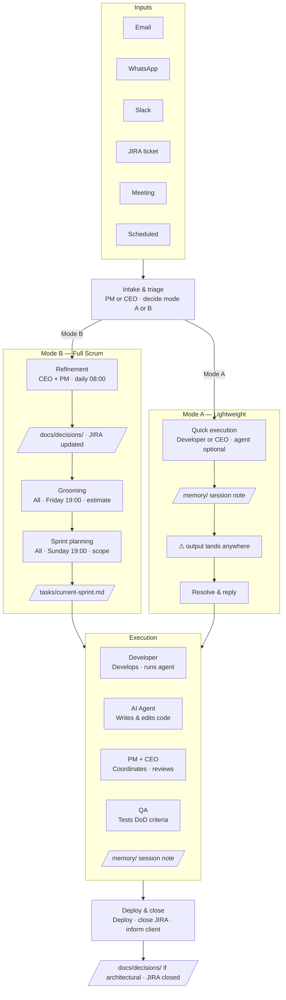
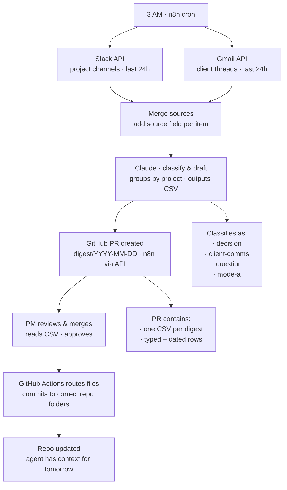
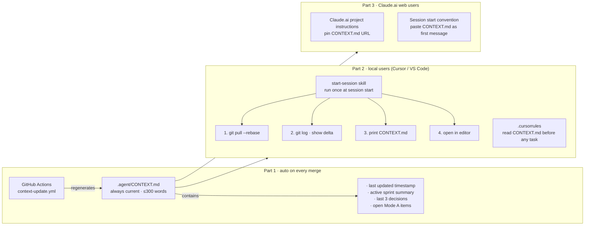
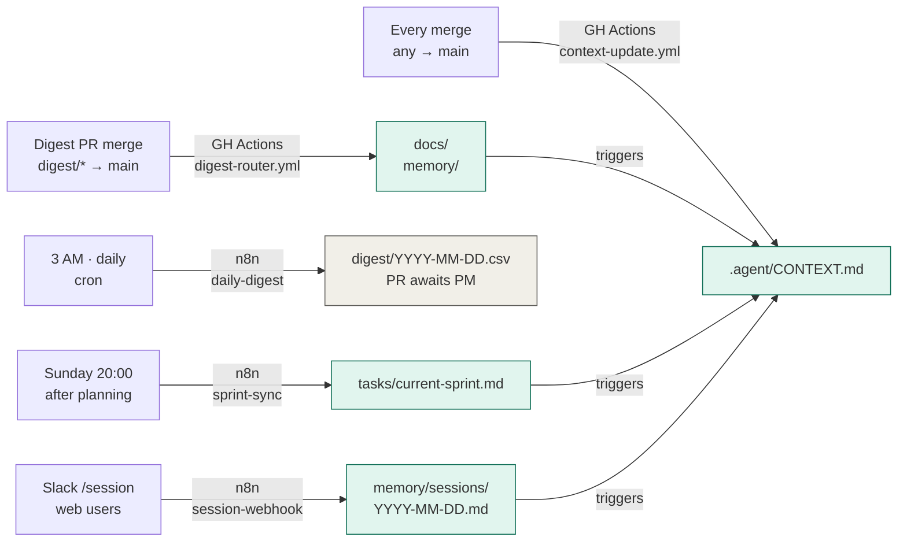
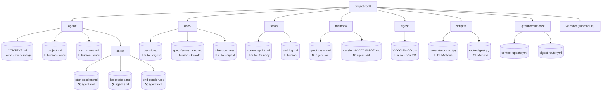
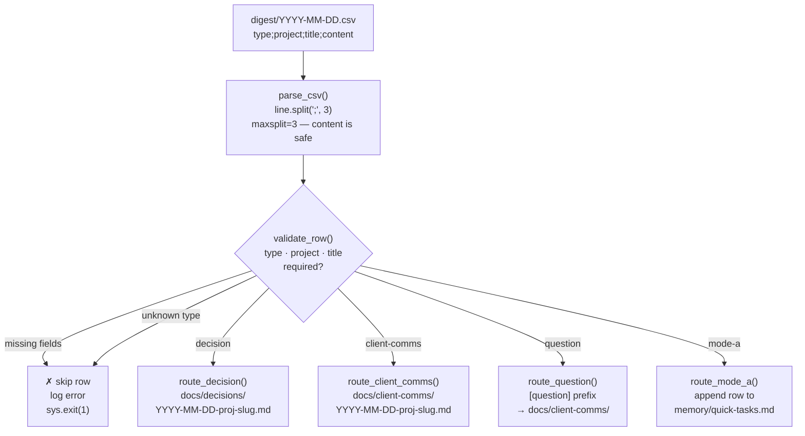

# Agent-Optimised Repo — Mermaid Diagrams

All diagrams from the workflow design session.

---

## Diagram 1 — Dual-Mode Workflow

---

## Diagram 2 — Daily Digest Automation Pipeline

---

## Diagram 3 — Session Sync System (Stale Context Fix)

---

## Diagram 4 — Sync Rules Overview

---

## Diagram 5 — Folder Structure & Ownership

---

## Diagram 6 — Digest CSV Routing Logic

---

*Generated from the agent-optimised repo design session.*
